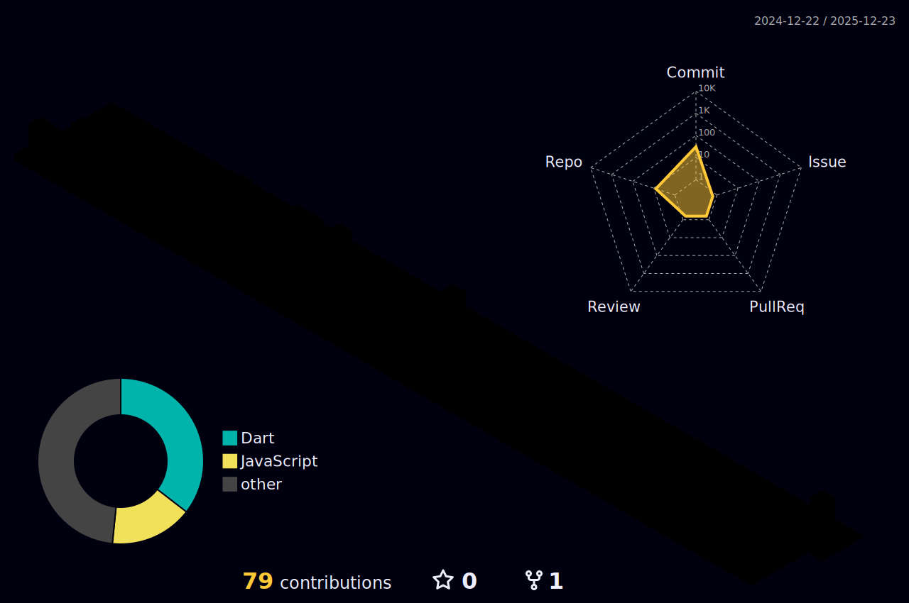

<h1 align="center">Oi! Eu sou o João Matheus de Lara 👋</h1>

  <b>Engenharia de sistemas aplicada à operação real</b> 
  Backend • Mobile • Integrações • Dados • Automação

  
  
  

 

  
  

 

  
  
  
  
  
  
  
  
  
  

---

## 🐍 Contribuições

---

## 🧊 Contribuições 3D

---

## 👨‍💻 Sobre mim
Atuo no desenvolvimento de sistemas completos, conectando **software, hardware e dados** para resolver problemas reais de operação.

Trabalho com:
- **Backend e APIs** (PHP/Laravel)
- **Mobile** (Flutter)
- **Integrações** (APIs, telemetria, dispositivos, sensores)
- **Dados e automação** (relatórios, eventos, regras e monitoramento)
- **Sistemas embarcados** (Arduino/C/C++)

Também tive contato na faculdade com **Java, JavaScript, Python, MySQL** e **testes automatizados com Cypress**.

---

## 📌 Projetos em destaque
- TSIGO: rastreamento, gestão de frotas, telemetria e sensores (temperatura, umidade, CO₂ e mais)
- Dev Lab: repositório de estudos e provas de conceito multi-linguagens
