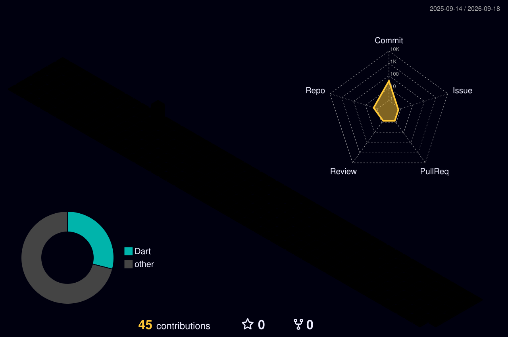

  

  
  
  
  

 

  
  
  
  
  
  
  
  
  
  

---

## 👨‍💻 Sobre mim

Atuo no desenvolvimento de soluções tecnológicas completas, integrando **software, hardware e dados** para resolver problemas reais de operação.

Atualmente trabalho na **TSIGO**, atuando no desenvolvimento de sistemas e na busca constante por novas tecnologias voltadas ao mercado de **automação, rastreamento, gestão de frotas, telemetria e monitoramento em tempo real**.

Tenho experiência prática em projetos **em produção**, com foco em **aplicações mobile, integrações, APIs, automações e sistemas operacionais para campo**.

---

## ⚙️ O que eu gosto de desenvolver

<table>
  <tr>
    <td width="50%">
      <h3>🛰️ Rastreamento e telemetria</h3>
      
Soluções para monitoramento em tempo real, gestão de frotas, eventos, alertas e dados operacionais.

    </td>
    <td width="50%">
      <h3>📱 Aplicações mobile</h3>
      
Aplicativos para operação em campo, motoristas, técnicos, checklists, jornada e sincronização com APIs.

    </td>
  </tr>
  <tr>
    <td width="50%">
      <h3>🔌 Integrações e automação</h3>
      
Integrações com equipamentos, sensores, APIs, protocolos e regras automáticas para melhorar processos.

    </td>
    <td width="50%">
      <h3>📊 Dados para operação</h3>
      
Transformação de dados em relatórios, indicadores e decisões mais rápidas para empresas.

    </td>
  </tr>
</table>

---

## 💼 Stack em uso prático

### Backend & APIs

### Mobile

### Integrações, IoT e automação

### Sistemas embarcados e base técnica

---

## 🎓 Base acadêmica e contato técnico

Durante minha formação em **Análise e Desenvolvimento de Sistemas**, tive contato e desenvolvimento de atividades utilizando:

Essa base contribuiu para minha evolução em **lógica, estrutura de dados, testes automatizados, banco de dados e boas práticas de desenvolvimento**.

---

## 📌 Projetos em destaque

> Alguns projetos são privados por envolverem regras de negócio, clientes, integrações e sistemas internos.

<table>
  <tr>
    <td width="50%">
      <h3>🛰️ Plataforma de rastreamento e gestão de frotas</h3>
      
Sistema para monitoramento em tempo real, eventos, alertas, relatórios e gestão operacional de veículos.

      

        
        
        
      

    </td>
    <td width="50%">
      <h3>📱 App mobile operacional</h3>
      
Aplicativo Flutter para uso em campo, com operação offline, sincronização de dados e integração com APIs.

      

        
        
        
      

    </td>
  </tr>
  <tr>
    <td width="50%">
      <h3>🌡️ Sensores e monitoramento</h3>
      
Soluções com sensores de temperatura, umidade, CO₂ e outros dados para controle operacional.

      

        
        
        
      

    </td>
    <td width="50%">
      <h3>🚚 Telemetria e automações</h3>
      
Integrações voltadas para eventos, comportamento de condução, alertas, regras automáticas e relatórios.

      

        
        
        
      

    </td>
  </tr>
</table>

---

## 🚀 Projetos privados também contam

Mesmo com vários projetos privados, mantenho meus códigos organizados no GitHub para ter:

- Histórico de evolução dos sistemas
- Controle de versões
- Backup seguro dos projetos
- Organização por aplicação, API e módulo
- Facilidade para apresentar algum projeto específico no futuro

---

## 📊 Atividade no GitHub

  

---

## 🐍 Contribuições em movimento

  

---

## 🧊 Contribuições 3D

  

---

## 🧠 Atualmente estudando e evoluindo em

<table>
  <tr>
    <td width="33%">
      <h3>📱 Mobile</h3>
      
Melhorando aplicações Flutter, integração com APIs, Firebase e funcionamento offline.

    </td>
    <td width="33%">
      <h3>🛰️ Telemetria</h3>
      
Aprofundando regras, eventos, dados em tempo real e comportamento operacional.

    </td>
    <td width="33%">
      <h3>⚙️ Automação</h3>
      
Criando soluções para reduzir trabalho manual e melhorar processos internos.

    </td>
  </tr>
</table>

---

  

